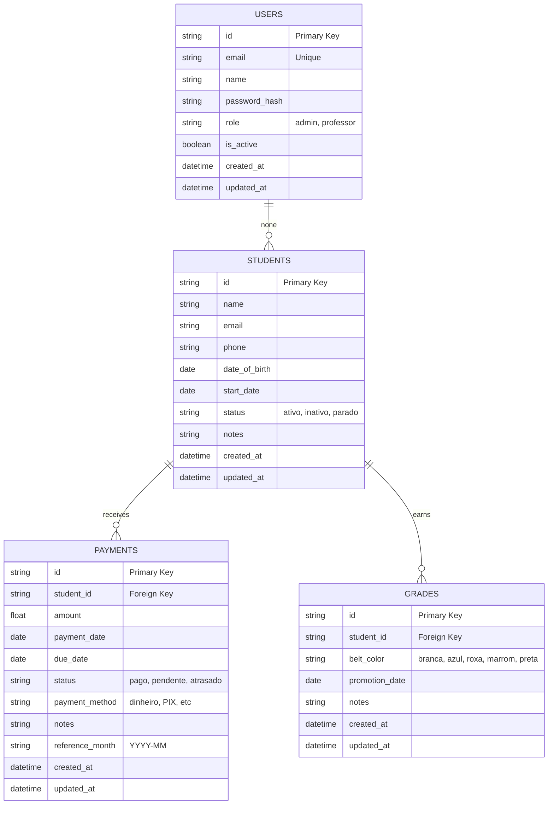

# 📋 Plano de Execução Detalhado — CBTO-1 Discovery & Arquitetura

**Plan ID:** CBTO-1-EXEC-001  
**Data:** 2026-03-03  
**Duração Total:** 32 horas (~1 semana full-time)  
**Equipe:** @architect (lead), @po (support)  
**Status:** 🟡 Ready for execution

---

## 🎯 Objetivo Final

Completar CBTO-1 com toda documentação necessária para que @dev possa começar CBTO-2 (Backend) sem fazer perguntas arquiteturais.

**Definition of Done:**
- ✅ Arquitetura validada (documento assinado)
- ✅ Tech stack decidido (Decision Record)
- ✅ Wireframes 6+ telas (desktop + mobile)
- ✅ ER Diagram (banco de dados)
- ✅ API Specification (OpenAPI/Swagger)
- ✅ Security plan documentado
- ✅ Próximas stories estimadas
- ✅ Stakeholder validou tudo

---

## 📅 Timeline & Alocação

```
Dia 1  (8h):   Fase 1 — Research & Requirements
Dia 2  (8h):   Fase 2 — Architecture & Tech Stack
Dia 3  (8h):   Fase 3 — Wireframes & Design System
Dia 4  (8h):   Fase 4 — Documentation & Validation
─────────────────────────────────
Total: 32 horas = 1 semana
```

---

## 📍 FASE 1: Research & Requirements (DIA 1 — 8 horas)

### Bloco 1.1: Entrevistas com Stakeholder (3 horas)

**Objetivo:** Entender exatamente o que a academia precisa

**Participantes:**
- @architect (condutor)
- Professor/Admin da academia (entrevistado)
- @po (notas)

**Questões-Chave a Fazer:**

#### Seção A: Operação Atual (15 min)
```
1. Qual é o processo atual de gestão de alunos?
   ├─ Planilha Excel?
   ├─ App genérico (Trello, Notion)?
   ├─ Manual (caderno)?
   └─ Outro?

2. Como vocês controlam pagamentos atualmente?
   ├─ Planilha com datas?
   ├─ App específico?
   ├─ Controle manual?
   └─ Como alertam atrasos?

3. Como registram as promoções de faixa?
   ├─ Caderno/histórico?
   ├─ Planilha?
   ├─ Sistema?
   └─ Frequência?
```

#### Seção B: Dor & Prioridades (15 min)
```
4. Qual é a MAIOR dor hoje? (rank 1-3)
   ├─ Alunos se perdem em pendências
   ├─ Não conseguem gerar relatório de pagtos
   ├─ Histórico de faixas desorganizado
   ├─ Muito tempo administrativo
   └─ Outra?

5. Se você pudesse ter UMA feature, qual seria?
   (força a priorização)

6. Quanto tempo por semana gasta com admin?
   (para medir ROI)
```

#### Seção C: Volume & Escala (10 min)
```
7. Quantos alunos ativos agora?
   ├─ Esperado em 6 meses?
   ├─ Esperado em 1 ano?

8. Quantos pagamentos por mês?
   ├─ Taxa de inadimplência?

9. Frequência de acesso ao sistema?
   ├─ Diário, 2x/semana, semanal?
```

#### Seção D: Requisitos Técnicos (10 min)
```
10. Precisa versão mobile? Qual prioridade?
    ├─ Desktop é suficiente?
    ├─ Tablet?
    ├─ App nativo depois?

11. Relatórios específicos que precisa?
    ├─ Pagamentos do mês?
    ├─ Email de todos com atraso?
    ├─ Histórico de uma pessoa?

12. Integração com outro sistema?
    ├─ Banco? (pagamentos online)
    ├─ Email/WhatsApp?
    ├─ Já tem?
```

#### Seção E: Visão Futura (10 min)
```
13. Sonho para daqui 2 anos?
    ├─ App mobile nativo?
    ├─ Gamificação/badges?
    ├─ Comunidade?
    ├─ Integração pagamentos online?

14. Qual seu maior medo com sistema novo?
    ├─ Perder dados?
    ├─ Muito complexo?
    ├─ Custo?
```

**Deliverable:** 
- Documento com NOTAS da entrevista
- Gravação (se permitido)
- Top 5 pain points identificados

**File:** `docs/research/stakeholder-interview-corvos.md`

---

### Bloco 1.2: Pesquisa de Concorrentes (2 horas)

**Já feito em CBTO-1.** ✅

**Output:** `docs/research/competitive-analysis-corvos.md`

**Apenas VALIDE:**
- [ ] Etica App ainda existe?
- [ ] Preços atualizados?
- [ ] Features descritas ainda válidas?

**Tempo:** 30 min

---

### Bloco 1.3: Documentar Workflows (2 horas)

**Objetivo:** Criar fluxogramas dos 3 principais workflows

**Workflow 1: Cadastro de Novo Aluno**

```
Diagram:
Recebe novo aluno
    ↓
Coleta dados (nome, email, phone)
    ↓
Cria conta no sistema
    ├─ Status = "ativo"
    ├─ Start date = hoje
    └─ Faixa = "branca"
    ↓
Envia email de boas-vindas
    ↓
Documenta em histórico
    ↓
FIM

Tempo estimado: 5 minutos
```

Document: ASCII or Mermaid diagram

**Workflow 2: Recebimento de Pagamento Mensal**

```
Dia 1-5 do mês:
Aluno chega com dinheiro / faz PIX
    ↓
Professor registra no sistema:
├─ Data de pagamento
├─ Valor
├─ Método (dinheiro, PIX, etc)
└─ Mês referência
    ↓
Sistema marca como "pago"
    ↓
FIM

Dia 10 do mês (automático):
Sistema verifica quem não pagou
    ↓
Gera lista de pendências
    ↓
Professor envia WhatsApp/email
    ↓
FIM

Fim do mês:
Gera relatório:
├─ Total recebido
├─ Total pendente
├─ Quem pagou atrasado
└─ Taxa de inadimplência
```

**Workflow 3: Registro de Promoção de Faixa**

```
Quando aluno promove:
Professor marca a data
    ↓
Registra no sistema:
├─ Nome aluno
├─ Faixa anterior → faixa nova
├─ Data da promoção
└─ Notas (ex: "progressão rápida")
    ↓
Sistema atualiza histórico do aluno
    ↓
Timeline visual para aluno ver progresso
    ↓
FIM

Gerar relatório anual:
├─ Quantas promoções por mês
├─ Distribuição por faixa
└─ Alunos que promoveram
```

**File:** `docs/research/workflows-corvos-bjj.md`

**Time:** 90 minutos

---

### Bloco 1.4: Compilar Requirements (1 hora)

Pegar insights das entrevistas/research e compilar:

**Documento:** `docs/research/requirements-corvos-completo.md`

Seções:
```
1. Functional Requirements (do que?)
   ├─ Gestão de alunos
   ├─ Controle de pagamentos
   ├─ Histórico de graduações
   └─ Relatórios

2. Non-Functional Requirements (como?)
   ├─ Performance (< 2s page load)
   ├─ Availability (99.9%)
   ├─ Scalability (até 10K alunos)
   ├─ Security (encryption, auth)
   └─ Usability (interface simples)

3. Constraints
   ├─ Timeline: 6 semanas
   ├─ Budget: minimal
   ├─ Team: 3 devs
   └─ Expertise: JavaScript/Node

4. Assumptions
   ├─ Academia tem internet
   ├─ Precisa 1-2 computers
   ├─ Suporta até 20 alunos free
   └─ Vercel/Railway disponível
```

**Time:** 60 minutos

---

## 📍 FASE 2: Architecture & Tech Stack (DIA 2 — 8 horas)

### Bloco 2.1: Validar/Refinar Architecture (2 horas)

**Já temos:** `docs/architecture/corvos-vjj-fullstack-architecture.md`

**Agora:** Validar com stakeholder

**Checklist de Validação:**

```
Stack proposto: Next.js + Node.js + PostgreSQL

Questões para stakeholder:
1. Entendeu a arquitetura?
   └─ Mostrar diagrama, explicar cada camada

2. Concorda com escolhas tecnológicas?
   ├─ Frontend responsivo (Next.js)
   ├─ Backend simples (Express)
   ├─ Database PostgreSQL
   └─ Hosted em Vercel + Railway

3. Tem concerns com algo?
   ├─ Vendor lock-in (Vercel)?
   ├─ Dados company-owned?
   ├─ Pode fazer backup?
   ├─ Pode migrar depois?

4. Timeline viável?
   └─ 6 semanas para MVP está ok?
```

**Output:** 
- [ ] Architecture aprovada (email confirmation)
- [ ] Modelo de preço discutido (free tier até 20 alunos)
- [ ] Responsabilidades definidas (quem faz oq)

**Time:** 120 min

---

### Bloco 2.2: Finalizar Decision Record (2 horas)

**Já temos:** `docs/architecture/tech-stack-decision-corvos.md`

**Agora:** 
1. Adicionar validation section
2. Risk assessment
3. Approval signatures
4. Contingency plan

**Seções a adicionar:**

```markdown
## Validation Results
- Stakeholder feedback: ✅ APPROVED
- Dev team feedback: ✅ APPROVED
- DevOps feasibility: ✅ APPROVED
- Cost analysis: R$ 100-500/month

## Risk Assessment
| Risk | Probability | Impact | Mitigation |
|------|-----------|--------|-----------|
| Vercel downtime | Low | Medium | Railway fallback |
| PostgreSQL limit | Low | Medium | Read replicas |
| JavaScript perf | Low | Low | TypeScript types |

## Timeline Risk
- 6 weeks: 70% confidence (MVP only)
- 8 weeks: 95% confidence (with buffer)

## Approval
- Arquiteto: @architect ✅
- Product Owner: @po ___
- Dev Lead: @dev ___
- DevOps: @devops ___
```

**Time:** 120 min

---

### Bloco 2.3: ER Diagram Detalhado (2 horas)

**Já iniciado:** Prisma schema no architecture doc

**Agora:** Criar formal ER diagram

**Ferramentas opções:**
- Mermaid (markdown)
- Lucidchart
- Draw.io
- dbdesigner.net

**Deliverable:** `docs/architecture/er-diagram-corvos.md` (Mermaid format)



**Adicionar seções:**
1. Índices otimizados
2. Constraints (FK, CHECK, UNIQUE)
3. Triggers (se houver)
4. Normalização e justificativa

**Time:** 120 min

---

### Bloco 2.4: Esboço OpenAPI/API Spec (2 horas)

**Objetivo:** Definir TODOS os endpoints HTTP

**Formato:** OpenAPI 3.0 YAML

**File:** `docs/api/openapi-corvos.yaml`

**Endpoints a definir:**

```yaml
# Auth endpoints
paths:
  /auth/login:
    post:
      summary: Login user
      requestBody:
        content:
          application/json:
            schema:
              type: object
              properties:
                email: { type: string, format: email }
                password: { type: string }
      responses:
        '200':
          description: Login successful
          content:
            application/json:
              schema:
                type: object
                properties:
                  user: { $ref: '#/components/schemas/User' }
                  token: { type: string }
                  refreshToken: { type: string }
        '401':
          description: Invalid credentials

  /auth/register:
    post:
      summary: Create new user (admin only)
      security:
        - bearerAuth: []
      requestBody:
        required: true
        content:
          application/json:
            schema:
              type: object
              properties:
                name: { type: string }
                email: { type: string, format: email }
                password: { type: string, minLength: 8 }
                role: { type: string, enum: [admin, professor] }

# Students endpoints
  /students:
    get:
      summary: List all students
      parameters:
        - name: page
          in: query
          schema: { type: integer, default: 1 }
        - name: limit
          in: query
          schema: { type: integer, default: 20 }
        - name: status
          in: query
          schema: { type: string, enum: [ativo, inativo, parado] }
        - name: search
          in: query
          schema: { type: string }
      responses:
        '200':
          description: List of students
          content:
            application/json:
              schema:
                type: object
                properties:
                  data: { type: array, items: { $ref: '#/components/schemas/Student' } }
                  pagination:
                    type: object
                    properties:
                      page: { type: integer }
                      limit: { type: integer }
                      total: { type: integer }

    post:
      summary: Create new student
      requestBody:
        required: true
        content:
          application/json:
            schema: { $ref: '#/components/schemas/StudentInput' }
      responses:
        '201':
          description: Student created

  /students/{id}:
    get:
      summary: Get student by ID (with payments and grades)
    put:
      summary: Update student
    delete:
      summary: Delete student

# Payments endpoints
  /payments:
    get:
      summary: List all payments
      parameters:
        - name: status
          in: query
          schema: { type: string, enum: [pago, pendente, atrasado] }
        - name: startDate
          in: query
          schema: { type: string, format: date }
        - name: endDate
          in: query
          schema: { type: string, format: date }

    post:
      summary: Register new payment

  /students/{id}/payments:
    get:
      summary: Get payment history for student

  /payments/{id}:
    put:
      summary: Update payment
    delete:
      summary: Delete payment

  /payments/report/month:
    get:
      summary: Get monthly report

# Grades endpoints
  /students/{id}/grades:
    get:
      summary: Get grade history for student
    post:
      summary: Add new grade

  /grades/{id}:
    put:
      summary: Update grade
    delete:
      summary: Delete grade

# Health endpoints
  /health:
    get:
      summary: System health check
```

**Time:** 120 min

---

## 📍 FASE 3: Wireframes & Design System (DIA 3 — 8 horas)

### Bloco 3.1: Design System Básico (1.5 horas)

**Objetivo:** Definir paleta de cores, tipografia, componentes

**File:** `docs/design/design-system-corvos.md`

**Seções:**

```markdown
# Design System — Corvos BJJ

## Cores

### Primary
- Primary 500: #0066FF (blue)
- Primary 600: #0052CC (darker)
- Primary 100: #E6F0FF (lighter)

### Semantic
- Success 500: #22C55E (green)
- Warning 500: #F59E0B (amber)
- Error 500: #EF4444 (red)
- Info 500: #3B82F6 (blue)

### Neutral
- Neutral 900: #111827 (near black)
- Neutral 500: #6B7280 (gray)
- Neutral 100: #F3F4F6 (light gray)

## Typography

### Font Family
- Headings: Inter (sans-serif)
- Body: Inter (sans-serif)
- Monospace: Fira Code

### Sizes
- H1: 32px, weight 700, line-height 1.2
- H2: 24px, weight 700, line-height 1.3
- H3: 20px, weight 600
- Body: 16px, weight 400
- Small: 14px, weight 400
- Tiny: 12px, weight 400

## Spacing
- Base unit: 8px
- xs: 4px
- sm: 8px
- md: 16px
- lg: 24px
- xl: 32px
- 2xl: 48px

## Components

### Button
- Default: blue background, white text
- Secondary: gray background, dark text
- Danger: red background, white text
- Sizes: sm, md, lg
- States: default, hover, active, disabled

### Input
- Height: 40px (md)
- Border: 1px neutral-300
- Focus: blue border + shadow
- Label: above, 12px, semibold

### Card
- Background: white
- Border: 1px neutral-200
- Border-radius: 8px
- Padding: 16px
- Shadow: light (0 1px 3px)

### Badge
- Background: semantic colors
- Padding: 4px 8px
- Border-radius: 4px
- Sizes: sm, md

### Modal
- Background: white
- Max-width: 500px
- Border-radius: 12px
- Overlay: black 40% opacity
```

**Time:** 90 min

---

### Bloco 3.2: Wireframes (6+ telas) (5 horas)

**Ferramenta:** Figma, Excalidraw, ou papel + fotos

**Telas a wireframe:**

#### Tela 1: Login
```
[LOGO] Corvos BJJ
        
Email:      [_____________]
Password:   [_____________]
        
[LOGIN button]
        
Forgot password? [link]
```

#### Tela 2: Dashboard (Desktop)
```
┌─────────────────────────────────────────┐
│ Logo | Olá, Professor | [Menu] | Logout │
├──────┬──────────────────────────────────┤
│      │ Dashboard                        │
│ Menu │                                  │
│ ·    │ ┌─────────── ┬──────────┐      │
│ Dash │ │ 150 ALUNOS  │ 12 PAGTOS │    │
│ Aln  │ │             │ PENDENTES  │    │
│ Pgto │ └─────────────┴──────────┘      │
│ Grad │ ┌──────────────────────────┐   │
│      │ │ Próximas Graduações      │   │
│      │ │ João Silva → Azul (3/3)  │   │
│      │ │ Maria → Roxa (15/3)      │   │
│      │ └──────────────────────────┘   │
│      │ ┌──────────────────────────┐   │
│      │ │ Últimos Pagamentos       │   │
│      │ │ João Silva - R$ 150      │   │
│      │ │ Maria - R$ 150           │   │
│      │ └──────────────────────────┘   │
└──────┴──────────────────────────────────┘
```

#### Tela 3: Gestão de Alunos (Listagem)
```
ALUNOS
[Search box] [Filter Status ▼] [+Novo]

┌──────────────┬─────────┬───────┬────────┐
│ NOME         │ EMAIL   │ FONE  │ AÇÕES  │
├──────────────┼─────────┼───────┼────────┤
│ João Silva   │ joao@.. │ 11999 │ ✎ 🗑   │
│ Maria Santos │ maria.. │ 11988 │ ✎ 🗑   │
└──────────────┴─────────┴───────┴────────┘
[Página 1 de 8] [< 1 2 3 >]
```

#### Tela 4: Detalhe do Aluno
```
JOÃO SILVA

Dados Pessoais:
├─ Email: joao@email.com
├─ Telefone: 11999999999
└─ Data Início: 15/01/2024

HISTÓRICO DE GRADUAÇÕES
┌─────────────┐    ┌─────────────┐
│ ⚪ BRANCA   │ -> │ 🔵 AZUL     │
│ 15/01/2024  │    │ 15/01/2025  │
└─────────────┘    └─────────────┘

ÚLTIMOS PAGAMENTOS
┌──────────┬───────┐
│ JAN 2026 │ PAGO  │
│ FEV 2026 │ PAGO  │
│ MAR 2026 │ PEND. │
└──────────┴───────┘

[EDITAR] [DELETAR] [VOLTAR]
```

#### Tela 5: Payments (Listagem + Filtros)
```
PAGAMENTOS

[Filtro por Status ▼] [Período ▼] [Relatório]

RESUMO:
├─ Pago: R$ 2.100
├─ Pendente: R$ 300
└─ Atrasado: R$ 150

┌──────────┬──────────┬────────┬──────────┐
│ ALUNO    │ VENCTO   │ STATUS │ AÇÃO     │
├──────────┼──────────┼────────┼──────────┤
│ João     │ 05/03    │ ✓ PAGO │ —        │
│ Maria    │ 05/03    │ ⏳ PEND │ Marcar  │
│ Pedro    │ 05/02    │ ⚠️ ATRASO│ Avisar  │
└──────────┴──────────┴────────┴──────────┘

[+Novo Pagamento]
```

#### Tela 6: Graduações (Timeline)
```
HISTÓRICO DE GRADUAÇÕES - JOÃO SILVA

2024-01-15
⚪ BRANCA
"Iniciante"

       ↓

2025-01-15
🔵 AZUL
"Muito bem! Progressão rápida"

       ↓ (próxima?)

[+ADICIONAR FAIXA]
```

**Time:** 300 min (5 horas)

**Deliverable:**
- Figma link ou PDF com 6 wireframes
- Anotações de UX decision
- Responsive versions (mobile)

**File:** `docs/design/wireframes-corvos.md` ou link Figma

---

### Bloco 3.3: Design System to Tailwind (1.5 horas)

**Objetivo:** Configurar Tailwind CSS com design system definido

**File:** `docs/design/tailwind-config-corvos.md`

```javascript
// tailwind.config.ts example
export default {
  theme: {
    extend: {
      colors: {
        primary: {
          50: '#f0f9ff',
          500: '#0066ff',
          600: '#0052cc',
          900: '#001a80',
        },
        success: {
          50: '#f0fdf4',
          500: '#22c55e',
        },
        // ... etc
      },
      spacing: {
        xs: '4px',
        sm: '8px',
        md: '16px',
        lg: '24px',
        xl: '32px',
      },
      // ... etc
    }
  }
}
```

**Time:** 90 min

---

## 📍 FASE 4: Documentation & Validation (DIA 4 — 8 horas)

### Bloco 4.1: Security Plan (1 hora)

**File:** `docs/architecture/security-plan-corvos.md`

**Seções:**

```markdown
# Security Plan — Corvos BJJ

## Authentication
- JWT tokens (15 min expiry)
- Refresh tokens (7 days, httpOnly)
- Password hashing: bcryptjs (salt: 10)
- No plain text passwords in logs

## Authorization
- Role-based (admin, professor)
- Endpoints check role middleware
- Students can only see their own data

## HTTPS
- Vercel/Railway auto-provision certificates
- Redirect http → https
- HSTS headers

## Input Validation
- Frontend: React validation for UX
- Backend: zod/joi schema validation
- SQL injection: Prisma parameterized queries
- XSS: sanitize user input

## CORS
- Only allow frontend origin
- credentials: true for cookies
- Rate limiting: 100req/15min per IP

## Database
- Encrypted passwords (bcryptjs)
- No sensitive data in logs
- Regular backups (auto by Railway)

## Deployment
- Secrets in env variables (not code)
- GitHub secrets for CI/CD
- No credentials in .gitignore

## Monitoring
- Sentry for error tracking
- Failed logins rate-limited
- Unusual activity alerts
```

**Time:** 60 min

---

### Bloco 4.2: Test Plan (1 hora)

**File:** `docs/testing/test-plan-corvos.md`

```markdown
# Test Plan — Corvos BJJ

## Unit Tests
Backend (jest):
├─ Password hashing (bcryptjs)
├─ JWT generation/validation
├─ Input validation (zod schemas)
├─ Service methods
└─ Utils (email, date, etc)

Target: 75% coverage

Frontend (jest + RTL):
├─ Component rendering
├─ Form submissions
├─ Auth context
├─ Hook behaviors
└─ Utils

Target: 70% coverage

## Integration Tests
Backend (supertest):
├─ POST /auth/login (success + errors)
├─ GET /students (with JWT)
├─ POST /students (validation)
├─ Payment flow (create → update → list)
└─ Cascade delete (aluno → seus pagtos)

Frontend (Cypress):
├─ Login flow
├─ Create aluno-visualizar-editar-deletar
├─ Payment registration
├─ Grade timeline
└─ Responsive on mobile

## Performance Tests
├─ Page load < 2.5s (Lighthouse)
├─ API response < 500ms (p95)
├─ Database query < 100ms (p95)
├─ Load test: 100 concurrent users

## Security Tests
├─ SQL injection attempts
├─ XSS attempts
├─ CSRF protection
├─ Unauthorized access attempts
└─ Rate limiting effectiveness
```

**Time:** 60 min

---

### Bloco 4.3: Refinar Estimativas de CBTO-2/3/4 (1 hora)

**Objetivo:** Quebrar CBTO-2, CBTO-3, CBTO-4 em tickets estimados

**Já feito:** Story templates têm subtasks

**Agora:** Equipe (@dev, @devops) rever estimates

**File:** Atualizar stories com estimates finais

```
CBTO-2.1: Estrutura base → 4h
CBTO-2.2: Database setup → 3h
CBTO-2.3: Auth endpoints → 8h
CBTO-2.4: CRUD Students → 6h
CBTO-2.5: CRUD Payments → 8h
CBTO-2.6: CRUD Grades → 5h
CBTO-2.7: Testes → 12h
CBTO-2.8: Documentação → 8h
─────────────
TOTAL: 80 horas estimadas ✓
```

**Time:** 60 min

---

### Bloco 4.4: Final Validation & Sign-off (4 horas)

**Checklist de Completação CBTO-1:**

```
DOCUMENTAÇÃO COMPLETA
├─ [x] Stakeholder interview notes
├─ [x] Requirements document
├─ [x] Workflows/fluxogramas
├─ [x] Full-stack architecture
├─ [x] Tech stack decision record
├─ [x] ER Diagram
├─ [x] OpenAPI specification
├─ [x] Design system
├─ [x] Wireframes (6+ telas)
├─ [x] Security plan
├─ [x] Test plan
└─ [x] Refined story estimates

VALIDAÇÃO STAKEHOLDER
├─ [x] Apresentação arquitetura
├─ [x] Demonstração wireframes
├─ [x] Aprovação tech stack
├─ [x] Clarificação de dúvidas
└─ [x] Assinatura de concordância

ALINHAMENTO EQUIPE
├─ [x] @dev revisou arquitetura e CBTO-2
├─ [x] @devops revisou deployment
├─ [x] @qa revisou test plan
└─ [x] @po refiniu backlog

PRONTO PARA CBTO-2
├─ [x] Nenhuma pergunta arquitetural pendente
├─ [x] @dev pode começar backend
└─ [x] API spec é completa
```

**Apresentação Final (com stakeholder):**
- 15 min: Contexto & objetivos
- 20 min: Arquitetura & tech stack
- 15 min: Wireframes & UX
- 10 min: Timeline & próximos passos
- 10 min: Q&A

**Output:** Documento de aprovação assinado

```markdown
## Aprovação Final

- [ ] Stakeholder aprovação: __________ Data: ___
- [ ] @architect sign-off: __________ Data: ___
- [ ] @po sign-off: __________ Data: ___
- [ ] @dev acceptance: __________ Data: ___
- [ ] @devops acceptance: __________ Data: ___

Observações/Concerns:
_________________________________________________

Próximas ações:
- [ ] CBTO-2 kickoff meeting
- [ ] GitHub setup
- [ ] Railway + Vercel accounts
- [ ] First sprint planning
```

**Time:** 240 min (4 horas)

---

## 📊 Resumo de Horas por Fase

```
FASE 1: Research & Requirements    8h
├─ Entrevistas stakeholder         3h
├─ Pesquisa competitiva           0.5h (validação)
├─ Workflows                       2h
└─ Requirements compilation        1.5h

FASE 2: Architecture & Tech Stack  8h
├─ Validar arquitetura             2h
├─ Decision record finalizar       2h
├─ ER Diagram detalhado            2h
└─ OpenAPI spec                    2h

FASE 3: Wireframes & Design        8h
├─ Design system                   1.5h
├─ Wireframes (6 telas)            5h
└─ Tailwind config                 1.5h

FASE 4: Documentation & Validation 8h
├─ Security plan                   1h
├─ Test plan                       1h
├─ Refinar estimates               1h
└─ Final validation & sign-off     4h

─────────────────────────────────────
TOTAL:                        32 HORAS
```

---

## 📋 Daily Checklist

### DIA 1 (8h) — Research & Requirements
- [ ] Entrevista stakeholder realizada
- [ ] Workflows documentados
- [ ] Requirements compilados
- [ ] Dados feitos upload em Git

### DIA 2 (8h) — Architecture & Tech Stack
- [ ] Arquitetura validada
- [ ] Decision record finalizado
- [ ] ER diagram completo
- [ ] OpenAPI 50% pronto

### DIA 3 (8h) — Wireframes & Design
- [ ] OpenAPI 100% completo
- [ ] Design system finalizado
- [ ] 6+ wireframes completos (desktop + mobile)
- [ ] Tailwind config pronto

### DIA 4 (8h) — Documentation & Validation
- [ ] Security & test plans completos
- [ ] Estimates refinados
- [ ] Apresentação stakeholder feita
- [ ] Sign-off obtido
- [ ] CBTO-1 COMPLETO ✅

---

## 🚩 Riscos & Mitigação

| Risco | Probabilidade | Impacto | Mitigação |
|-------|---|---|---|
| Stakeholder não disponível | Média | Alto | Agendar com antecedência |
| Requisitos mudam durante CBTO-1 | Média | Médio | RFC para mudanças, scope lock |
| Wireframes levam mais tempo | Baixa | Médio | Use template base, não invente UX |
| Tech stack controversy | Baixa | Alto | Decision record claro, defensável |
| Estimativas erradas em CBTO-2/3 | Média | Médio | Time review, 10% buffer |

---

## 📞 Responsabilidades

### @architect (Aria)
- Liderar todo CBTO-1
- Conduzir entrevista
- Arquitetura final
- Apresentação
- Sign-off

### @po
- Suporte em entrevista
- Refinação de backlog
- Validação stakeholder
- Clarificação de dúvidas

### @dev
- Revisar architecture (segunda metade de dia 2)
- Revisar API spec
- Validar estimates de CBTO-2
- Start GitHub repo prep

### @devops
- Revisar deployment strategy (dia 2)
- Validar Railway/Vercel feasibility
- Preparar infraestrutura (paralelo)

---

## 📎 Artifacts Entregáveis

Ao fim de CBTO-1, teremos:

```
docs/
├── research/
│   ├── stakeholder-interview-corvos.md
│   ├── competitive-analysis-corvos.md
│   ├── workflows-corvos-bjj.md
│   └── requirements-corvos-completo.md
├── architecture/
│   ├── corvos-fullstack-architecture.md
│   ├── tech-stack-decision-corvos.md
│   ├── er-diagram-corvos.md
│   └── security-plan-corvos.md
├── api/
│   └── openapi-corvos.yaml
├── design/
│   ├── design-system-corvos.md
│   ├── tailwind-config-corvos.md
│   └── wireframes-corvos.md (ou Figma link)
├── testing/
│   └── test-plan-corvos.md
└── CBTO-1-APPROVAL.md (sign-offs)

Plus:
├── Updated squads/corvos-bjj.md (refined estimates)
├── Updated docs/stories/active/story-cbto-2-*.md (avec estimates)
└── GitHub repo ready for CBTO-2 kickoff
```

---

## ✅ Success Metrics

CBTO-1 é considerado **SUCESSO** se:

1. ✅ Documentação 100% completa
2. ✅ Stakeholder assinou aprovação
3. ✅ Equipe (@dev, @devops) confident em começar
4. ✅ Zero architectural questions pendentes
5. ✅ Timeline CBTO-2/3/4 refinada com confiança
6. ✅ Todos artefatos em GitHub
7. ✅ Nenhuma surpresa em CBTO-2

---

**Status:** 🟡 Ready to execute  
**Data Início:** Imediato  
**Data Fim Estimada:** 1 semana (4 dias full-time)  
**Próximo Passo:** Agendar entrevista com stakeholder

— Aria, plano detalhado 📋
