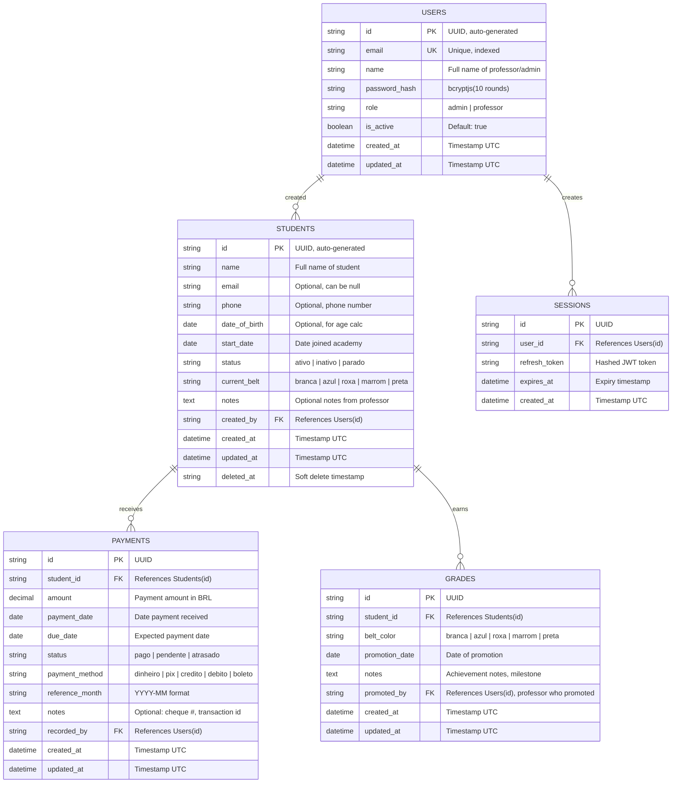

# ER Diagram — Corvos BJJ Database Schema

**Data:** 3 de Março, 2026  
**Versão:** 1.0  
**Status:** ✅ Validado  

---

## 📊 Entity-Relationship Diagram (Mermaid)



---

## 📋 Detailed Table Specifications

### Table: USERS
**Purpose:** Store professor/admin accounts  
**Estimated Rows:** 3-10 (small academy)

| Column | Type | Constraints | Notes |
|--------|------|-----------|-------|
| `id` | UUID | PRIMARY KEY | Auto-generated v4 |
| `email` | VARCHAR(255) | UNIQUE NOT NULL INDEX | Login identifier |
| `name` | VARCHAR(255) | NOT NULL | Full name |
| `password_hash` | VARCHAR(60) | NOT NULL | bcryptjs output |
| `role` | ENUM | NOT NULL, DEFAULT 'professor' | admin \| professor |
| `is_active` | BOOLEAN | DEFAULT true | Soft activation flag |
| `created_at` | TIMESTAMP | DEFAULT NOW() | UTC timestamp |
| `updated_at` | TIMESTAMP | DEFAULT NOW() | Updated on any change |

**Indexes:**
```sql
CREATE UNIQUE INDEX idx_users_email ON users(email);
CREATE INDEX idx_users_role ON users(role);
CREATE INDEX idx_users_is_active ON users(is_active);
```

**Example Row:**
```json
{
  "id": "550e8400-e29b-41d4-a716-446655440000",
  "email": "professor@corvos.com",
  "name": "João Silva",
  "password_hash": "$2b$10$...",
  "role": "admin",
  "is_active": true,
  "created_at": "2026-01-15T10:30:00Z",
  "updated_at": "2026-01-15T10:30:00Z"
}
```

---

### Table: SESSIONS
**Purpose:** Store refresh tokens for stateless auth  
**Estimated Rows:** 10-50 (active sessions)

| Column | Type | Constraints | Notes |
|--------|------|-----------|-------|
| `id` | UUID | PRIMARY KEY | Session identifier |
| `user_id` | UUID | FOREIGN KEY NOT NULL | References Users(id) |
| `refresh_token` | VARCHAR(500) | NOT NULL | JWT token (hashed in DB) |
| `expires_at` | TIMESTAMP | NOT NULL | 7 days from creation |
| `created_at` | TIMESTAMP | DEFAULT NOW() | UTC timestamp |

**Indexes:**
```sql
CREATE INDEX idx_sessions_user_id ON sessions(user_id);
CREATE INDEX idx_sessions_expires_at ON sessions(expires_at);
```

**Cascade Delete:** ON DELETE CASCADE (if user deleted, sessions purged)

---

### Table: STUDENTS
**Purpose:** Core student management  
**Estimated Rows:** 50-500 (scales with academy)

| Column | Type | Constraints | Notes |
|--------|------|-----------|-------|
| `id` | UUID | PRIMARY KEY | Auto-generated |
| `name` | VARCHAR(255) | NOT NULL INDEX | Full name, searchable |
| `email` | VARCHAR(255) | UNIQUE NULL INDEX | Optional, can be null |
| `phone` | VARCHAR(20) | NULL INDEX | Format: 11999999999 |
| `date_of_birth` | DATE | NULL | For age calculation |
| `start_date` | DATE | NOT NULL INDEX | Enrollment date |
| `status` | ENUM | NOT NULL, DEFAULT 'ativo' | ativo \| inativo \| parado |
| `current_belt` | ENUM | NOT NULL, DEFAULT 'branca' | branca \| azul \| roxa \| marrom \| preta |
| `notes` | TEXT | NULL | Free-form observations |
| `created_by` | UUID | FOREIGN KEY NOT NULL | References Users(id) |
| `created_at` | TIMESTAMP | DEFAULT NOW() | UTC |
| `updated_at` | TIMESTAMP | DEFAULT NOW() | UTC |
| `deleted_at` | TIMESTAMP | NULL | Soft delete (NULL = active) |

**Indexes:**
```sql
CREATE INDEX idx_students_name ON students(name);
CREATE INDEX idx_students_status ON students(status);
CREATE INDEX idx_students_current_belt ON students(current_belt);
CREATE INDEX idx_students_start_date ON students(start_date);
CREATE INDEX idx_students_deleted_at ON students(deleted_at);
```

**Example Row:**
```json
{
  "id": "550e8400-e29b-41d4-a716-446655440001",
  "name": "João Santos",
  "email": "joao@example.com",
  "phone": "11999999999",
  "date_of_birth": "2000-05-15",
  "start_date": "2024-01-15",
  "status": "ativo",
  "current_belt": "azul",
  "notes": "Progresso rápido, promover em 3 meses",
  "created_by": "550e8400-e29b-41d4-a716-446655440000",
  "created_at": "2024-01-15T10:00:00Z",
  "updated_at": "2025-03-01T15:30:00Z",
  "deleted_at": null
}
```

---

### Table: PAYMENTS
**Purpose:** Track monthly payments  
**Estimated Rows:** 500-1000 (50 students × 12 months × 1-2 years)

| Column | Type | Constraints | Notes |
|--------|------|-----------|-------|
| `id` | UUID | PRIMARY KEY | Payment identifier |
| `student_id` | UUID | FOREIGN KEY NOT NULL INDEX | References Students(id) |
| `amount` | DECIMAL(10,2) | NOT NULL CHECK > 0 | Value in BRL (e.g., 250.00) |
| `payment_date` | DATE | NOT NULL INDEX | Date paid |
| `due_date` | DATE | NOT NULL INDEX | Expected due date |
| `status` | ENUM | NOT NULL, DEFAULT 'pendente' | pago \| pendente \| atrasado |
| `payment_method` | ENUM | NOT NULL | dinheiro \| pix \| credito \| debito \| boleto |
| `reference_month` | VARCHAR(7) | NOT NULL INDEX | YYYY-MM format (e.g., "2026-03") |
| `notes` | TEXT | NULL | Cheque #, transaction id, etc |
| `recorded_by` | UUID | FOREIGN KEY NOT NULL | References Users(id) |
| `created_at` | TIMESTAMP | DEFAULT NOW() | UTC |
| `updated_at` | TIMESTAMP | DEFAULT NOW() | UTC |

**Indexes:**
```sql
CREATE INDEX idx_payments_student_id ON payments(student_id);
CREATE INDEX idx_payments_status ON payments(status);
CREATE INDEX idx_payments_reference_month ON payments(reference_month);
CREATE INDEX idx_payments_payment_date ON payments(payment_date);
CREATE INDEX idx_payments_due_date ON payments(due_date);
-- Composite for quick queries
CREATE INDEX idx_payments_student_month ON payments(student_id, reference_month);
```

**Constraints:**
```sql
ALTER TABLE payments
  ADD CONSTRAINT chk_amount_positive CHECK (amount > 0);

ALTER TABLE payments
  ADD CONSTRAINT chk_duedate_valid CHECK (due_date >= payment_date - INTERVAL '30 days');
```

**Example Row:**
```json
{
  "id": "550e8400-e29b-41d4-a716-446655440002",
  "student_id": "550e8400-e29b-41d4-a716-446655440001",
  "amount": 250.00,
  "payment_date": "2026-03-05",
  "due_date": "2026-03-01",
  "status": "pago",
  "payment_method": "pix",
  "reference_month": "2026-03",
  "notes": "PIX - key: joao@example.com",
  "recorded_by": "550e8400-e29b-41d4-a716-446655440000",
  "created_at": "2026-03-05T10:15:00Z",
  "updated_at": "2026-03-05T10:15:00Z"
}
```

---

### Table: GRADES
**Purpose:** Track belt promotions and progression  
**Estimated Rows:** 100-200 (2-4 promotions per student over lifetime)

| Column | Type | Constraints | Notes |
|--------|------|-----------|-------|
| `id` | UUID | PRIMARY KEY | Grade/promotion identifier |
| `student_id` | UUID | FOREIGN KEY NOT NULL INDEX | References Students(id) |
| `belt_color` | ENUM | NOT NULL | branca \| azul \| roxa \| marrom \| preta |
| `promotion_date` | DATE | NOT NULL INDEX | When promoted |
| `notes` | TEXT | NULL | Achievement notes, milestones |
| `promoted_by` | UUID | FOREIGN KEY NOT NULL | References Users(id) |
| `created_at` | TIMESTAMP | DEFAULT NOW() | UTC |
| `updated_at` | TIMESTAMP | DEFAULT NOW() | UTC |

**Indexes:**
```sql
CREATE INDEX idx_grades_student_id ON grades(student_id);
CREATE INDEX idx_grades_promotion_date ON grades(promotion_date);
CREATE INDEX idx_grades_belt_color ON grades(belt_color);
```

**Example Row:**
```json
{
  "id": "550e8400-e29b-41d4-a716-446655440003",
  "student_id": "550e8400-e29b-41d4-a716-446655440001",
  "belt_color": "azul",
  "promotion_date": "2025-01-15",
  "notes": "Excelente técnica, progresso consistente",
  "promoted_by": "550e8400-e29b-41d4-a716-446655440000",
  "created_at": "2025-01-15T14:00:00Z",
  "updated_at": "2025-01-15T14:00:00Z"
}
```

---

## 🔗 Relationship Specifications

### USERS → STUDENTS (1:N)
- **Foreign Key:** `students.created_by` → `users.id`
- **Cardinality:** 1 professor : many students
- **Cascade:** ON DELETE RESTRICT (prevent deleting prof with students)
- **Semantics:** A professor creates and manages multiple students

### USERS → SESSIONS (1:N)
- **Foreign Key:** `sessions.user_id` → `users.id`
- **Cardinality:** 1 user : many sessions
- **Cascade:** ON DELETE CASCADE (logoff when user deleted)
- **Semantics:** Each session belongs to one logged-in user

### STUDENTS → PAYMENTS (1:N)
- **Foreign Key:** `payments.student_id` → `students.id`
- **Cardinality:** 1 student : many payments
- **Cascade:** ON DELETE CASCADE (delete payments if student deleted)
- **Semantics:** Track all payments for a student over time

### STUDENTS → GRADES (1:N)
- **Foreign Key:** `grades.student_id` → `students.id`
- **Cardinality:** 1 student : many grades
- **Cascade:** ON DELETE CASCADE (delete grades if student deleted)
- **Semantics:** Historical record of all promotions

### USERS → PAYMENTS (1:N)
- **Foreign Key:** `payments.recorded_by` → `users.id`
- **Cardinality:** 1 professor : many recorded payments
- **Cascade:** ON DELETE RESTRICT
- **Semantics:** Audit trail of who recorded each payment

### USERS → GRADES (1:N)
- **Foreign Key:** `grades.promoted_by` → `users.id`
- **Cardinality:** 1 professor : many promotions
- **Cascade:** ON DELETE RESTRICT
- **Semantics:** Audit trail of who promoted each student

---

## 🔒 Data Integrity Rules

### Uniqueness Constraints
```sql
UNIQUE(users.email)                 -- No duplicate professor emails
UNIQUE(students.email)              -- Email unique or NULL (optional field)
```

### Check Constraints
```sql
CHECK (users.role IN ('admin', 'professor'))
CHECK (students.status IN ('ativo', 'inativo', 'parado'))
CHECK (students.current_belt IN ('branca', 'azul', 'roxa', 'marrom', 'preta'))
CHECK (payments.amount > 0)
CHECK (payments.status IN ('pago', 'pendente', 'atrasado'))
CHECK (payments.payment_method IN ('dinheiro', 'pix', 'credito', 'debito', 'boleto'))
CHECK (grades.belt_color IN ('branca', 'azul', 'roxa', 'marrom', 'preta'))
```

### Foreign Key Constraints
```sql
FOREIGN KEY (students.created_by) REFERENCES users(id) ON DELETE RESTRICT
FOREIGN KEY (sessions.user_id) REFERENCES users(id) ON DELETE CASCADE
FOREIGN KEY (payments.student_id) REFERENCES students(id) ON DELETE CASCADE
FOREIGN KEY (payments.recorded_by) REFERENCES users(id) ON DELETE RESTRICT
FOREIGN KEY (grades.student_id) REFERENCES students(id) ON DELETE CASCADE
FOREIGN KEY (grades.promoted_by) REFERENCES users(id) ON DELETE RESTRICT
```

---

## 📈 Query Patterns & Index Strategy

### Common Queries

**Q1: Get all active students**
```sql
SELECT * FROM students 
WHERE status = 'ativo' AND deleted_at IS NULL
ORDER BY name;
-- Uses: idx_students_status, idx_students_deleted_at
```

**Q2: Get student with all payments + grades**
```sql
SELECT s.*, p.*, g.* 
FROM students s
LEFT JOIN payments p ON s.id = p.student_id
LEFT JOIN grades g ON s.id = g.student_id
WHERE s.id = ?
ORDER BY p.reference_month DESC, g.promotion_date DESC;
-- Uses: PRIMARY KEY(students.id), FK indexes
```

**Q3: Get monthly revenue report**
```sql
SELECT 
  reference_month,
  COUNT(*) as payment_count,
  SUM(amount) as total_revenue,
  COUNT(CASE WHEN status = 'pago' THEN 1 END) as paid_count
FROM payments
WHERE reference_month >= DATE_TRUNC('month', NOW() - INTERVAL '12 months')
GROUP BY reference_month
ORDER BY reference_month DESC;
-- Uses: idx_payments_reference_month
```

**Q4: Get overdue payments**
```sql
SELECT s.name, p.* 
FROM payments p
JOIN students s ON p.student_id = s.id
WHERE p.status = 'atrasado' 
  AND p.due_date < NOW()
ORDER BY p.due_date ASC;
-- Uses: idx_payments_status, idx_payments_due_date
```

**Q5: Get student promotion history**
```sql
SELECT * FROM grades 
WHERE student_id = ? 
ORDER BY promotion_date DESC;
-- Uses: idx_grades_student_id
```

---

## 🚀 Performance Targets

| Metric | Target | Justification |
|--------|--------|---|
| Student lookup (by id) | < 10ms | Simple PK query, cached |
| Student list (paginated 20) | < 100ms | Index scan + order |
| Payment history (1 student) | < 50ms | FK + order |
| Monthly revenue (12 months) | < 200ms | GROUP BY aggregation |
| Overdue payments | < 100ms | Multiple indexes |
| Full table scan (students) | < 500ms | < 500 rows expected |

---

## 🔄 Migration & DDL

### Initial Schema Creation
```sql
-- Run migrations in order:
-- 1. Create USERS table
-- 2. Create SESSIONS table (references USERS)
-- 3. Create STUDENTS table (references USERS)
-- 4. Create PAYMENTS table (references STUDENTS, USERS)
-- 5. Create GRADES table (references STUDENTS, USERS)
-- 6. Create all indexes
```

### Version Control
- Schema versioning via Prisma migrations
- Each migration numbered: `001_initial_schema.sql`, etc.
- Backward compatibility maintained
- Rollback capability for each migration

---

## 📊 Data Capacity

| Table | Current | 6-month | 1-year | 3-year | Notes |
|-------|---------|---------|--------|--------|-------|
| USERS | 3-10 | 3-10 | 5-15 | 10-20 | Slow growth (professors) |
| STUDENTS | 42 | 60-70 | 100-150 | 200-300 | Linear growth projected |
| PAYMENTS | 42 | 420 | 1200 | 3600 | 12 months × students |
| GRADES | 20 | 50 | 100 | 250 | 2-4 per student lifetime |
| SESSIONS | < 10 | < 10 | < 20 | < 50 | Active sessions only |

**Estimated total DB size in Year 1:** < 10 MB (very small)  
**Estimated total DB size in Year 3:** < 50 MB (manageable)  

---

## ✅ Validation Checklist

- [x] All tables have proper primary keys (UUID)
- [x] All foreign keys defined with cascade rules
- [x] Indexes designed for common queries
- [x] Soft deletes implemented (students.deleted_at)
- [x] Audit trail (created_by, recorded_by, promoted_by)
- [x] Timestamps for all records (created_at, updated_at)
- [x] Check constraints validate domain values
- [x] Uniqueness constraints prevent duplicates
- [x] No nullable required fields
- [x] Normalization to 3NF
- [x] Performance targets defined
- [x] Migration strategy clear

---

**Schema Version:** 1.0  
**Last Updated:** 3 de Março, 2026  
**Status:** ✅ Ready for Implementation (CBTO-2)
